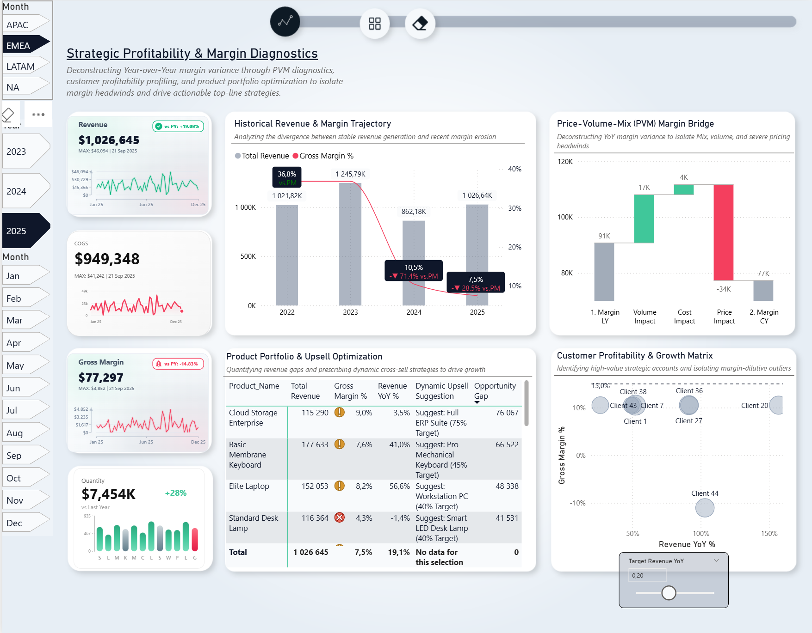
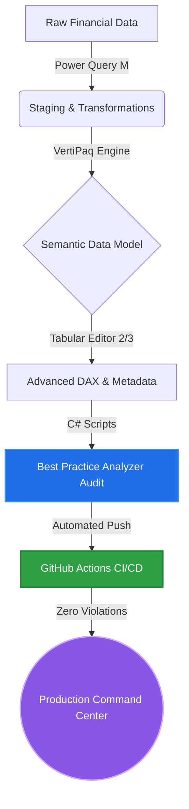
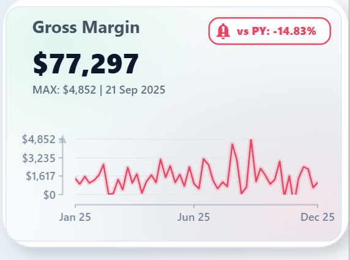

# 📊 Strategic Profitability & Margin Diagnostics Command Center


*(Tip: You can place an animated GIF of your dashboard in action here! Example: ``)*


## 🚀 Enterprise Analytics Pipeline & CI/CD Architecture

This project strictly follows an automated deployment and validation pipeline, ensuring only highly optimized, error-free models reach production.



---

## 📌 Executive Summary & The Business Problem
This project is an enterprise-grade Power BI analytical solution designed to diagnose and combat margin erosion. The core business challenge analyzed here is a phenomenon known as **"buying market share."** 

Despite maintaining a steady Year-to-Date (YTD) Revenue of ~$3.05M (+0.22% YoY), the Gross Margin percentage collapsed from a historical baseline of >30% down to 16.3%. This Command Center was built to deconstruct the "Why" behind the variance and provide actionable insights for the FP&A (Financial Planning & Analysis) and Sales controlling teams.

---

## 🧠 1. FP&A & Controlling Deep Dive: The Business Narrative

The traditional "Year-over-Year Variance" analysis often creates a false sense of security. This analytical model was built to shift the narrative from *reporting what happened* to *diagnosing why it happened*.

### 🔍 Price-Volume-Mix (PVM) Diagnostics
The cornerstone of this model is the dynamic PVM Bridge. Standard financial reporting shows a margin drop of $25.27% YoY. By mathematically isolating the variance drivers, the model reveals:
*   **The Price Leakage:** Volume and Cost impacts were negligible (+$1.45K and +$18.4K). The entire margin erosion is isolated to **Price Impact (-$188.11K)**. The sales force is driving volume through severe, undocumented commercial discounting.
*   **Strategic Imperative:** The business does not have a cost control problem; it has a severe price realization and discount governance problem. 

### 🎯 Customer Quadrant Analysis: The "Empty Calories" Problem
Not all revenue is good revenue. The Customer Profitability Matrix dynamically plots clients on a Revenue YoY vs. Gross Margin % scatter plot. 
*   **Value Destroyers:** Accounts located in the bottom-right quadrant show massive YoY revenue growth (>100%) but operate at single-digit or negative margins. These are "empty calorie" accounts—cannibalizing operational capacity without contributing to the bottom line.

### 💼 Portfolio Optimization & Dynamic Upsell
To recover the diluted margin, the dashboard prescribes cross-sell opportunities. The table dynamically calculates the "Opportunity Gap" by evaluating current penetration of high-yield products and suggesting targeted upsell campaigns to close the revenue gap.

---

## ⚙️ 2. Senior Power BI Architecture: Under the Hood

Translating complex FP&A logic into a lightning-fast Power BI model requires strict adherence to Enterprise BI patterns. This model is engineered for scale, maintainability, and VertiPaq engine optimization.

### 🏗️ Data Modeling & VertiPaq Optimization
*   **Strict Star Schema:** The foundation is a fully normalized Star Schema. Fact tables (`Fact_Sales`) are entirely hidden from the end-user, exposing only explicit DAX measures.
*   **Data Type Engineering:** To maximize memory compression and eliminate floating-point arithmetic errors (crucial in financial models), all monetary and percentage columns are cast to `Fixed Decimal`, and keys are cast to `Integer`.
*   **MDX Attribute Disabling:** To reduce memory footprint and speed up processing, the `IsAvailableInMdx` property is set to `false` for non-attribute fact columns, preventing the engine from building unnecessary hidden hierarchies for Excel PivotTable consumption.

### 💻 Advanced DAX & Disconnected Tables
*   **Dynamic PVM Waterfall:** The calculation relies on a disconnected table (`Steps_PVM`) and complex DAX `SWITCH()` logic. This allows the DAX engine to inject virtual rows into the visual context, calculating iterative variances dynamically.
*   **Parameter-Driven Slicers:** Disconnected tables via `GENERATESERIES` allow users to inject custom variables directly into the DAX filter context for real-time scenario simulations.

---

## 🔬 3. Advanced DAX Showcase: In-Memory SVG Rendering

To maximize visual performance and eliminate the need for heavy custom visuals, KPI trendlines are rendered natively using Vector Graphics (SVG) computed dynamically in memory.

<details>
<summary><b>🔥 Click to expand: Dynamic SVG Sparkline DAX Formulation</b></summary>

```dax
KPI Card SVG (Gross Margin over Date + Axes) - HOLO3 = 
-- =========================
-- 1. GŁÓWNE WYMIARY KARTY 
-- =========================
VAR CardW = 700  -- Szerokość całkowita
VAR CardH = 500  -- Wysokość całkowita

-- Marginesy i zmienne zależne (automatyczne skalowanie)
VAR Pad = 18
VAR RectW = CardW - (Pad * 2)
VAR RectH = CardH - (Pad * 2)

VAR TitleX = CardW / 2
VAR PillW = 240
VAR PillX = CardW - PillW - 40
VAR ShapeX = PillX + 8
VAR VsTextX = PillX + 55

-- Pobranie wartości YoY do zmiennej
VAR YoYValue = [Gross Margin YoY %]
VAR IsPositive = YoYValue >= 0

-- Dynamiczny główny kolor: Zielony jeśli na plusie, Czerwony jeśli na minusie
VAR MainColor = IF(IsPositive, "#10B981", "#F43F5E")

VAR Title = "Gross Margin "
VAR BigValue = FORMAT ( [Gross Margin], "$#,0" )
-- Dynamiczne formatowanie (z minusem lub plusem)
VAR VsLabel = "vs PY: " & FORMAT(YoYValue, "+0.00%;-0.00%;0%")

/* =========
   Obliczanie MAX i daty
   ========= */
-- 1. Znajdujemy najwyższy dzienny wynik w wybranym okresie
VAR _MaxDailyRevenue = MAXX(VALUES('Date'[Date]), [Gross Margin])

-- 2. Szukamy konkretnej daty, w której wystąpił ten maksymalny wynik
-- (Używamy MIN, aby w razie remisu - dwóch dni z tym samym wynikiem - wziąć pierwszą datę)
VAR _MaxDate = 
    CALCULATE(
        MIN('Date'[Date]), 
        FILTER(
            VALUES('Date'[Date]), 
            [Gross Margin] = _MaxDailyRevenue
        )
    )

-- 3. Formatujemy wartości do wyświetlenia jako tekst
VAR _FormattedMaxRev = FORMAT(_MaxDailyRevenue, "$#,0") -- Dodaj np. "K" lub "M" jeśli chcesz skrócić
VAR _FormattedDate = FORMAT(_MaxDate, "dd MMM yyyy") -- Da wynik np. "15 Jun 2023"

-- 4. Sklejamy gotową linijkę tekstu
VAR Line2 = "MAX: " & _FormattedMaxRev & " | " & _FormattedDate

-- =========================
-- 2. LAYOUT WYKRESU (zależny od szerokości i wysokości karty)
-- =========================
VAR AxisX = 130
VAR X0    = AxisX + 25
VAR X1    = CardW - 65

VAR YTop  = CardH - 220
VAR YBot  = CardH - 110
VAR AxisY = CardH - 90

-- Dynamiczna zmiana ikony
VAR _shape = 
    IF(IsPositive,
        "<svg x='" & ShapeX & "' y='46' width='40' height='40' viewBox='0 0 24 24'><circle cx='12' cy='12' r='10' fill='" & MainColor & "'/><path d='M9 12l2 2 4-4' stroke='white' stroke-width='2' fill='none' stroke-linecap='round' stroke-linejoin='round'/></svg>",
        "<svg x='" & ShapeX & "' y='46' width='40' height='40' fill='" & MainColor & "' viewBox='0 0 24 24'><path d='M12 22c1.1 0 2-.9 2-2h-4a2 2 0 002 2zm6-6v-5c0-3.07-1.64-5.64-4.5-6.32V4a1.5 1.5 0 00-3 0v.68C7.63 5.36 6 7.92 6 11v5l-2 2v1h16v-1l-2-2z'/><text x='12' y='18' font-size='16' font-family='Segoe UI' font-weight='bold' fill='white' text-anchor='middle'>!</text></svg>"
    )

-- Daty w kontekście
VAR DatesInScope =
    CALCULATETABLE (
        VALUES ( 'Date'[Date] ),
        ALLSELECTED ( 'Date'[Date] )
    )

-- Sales per dzień
VAR Series0 =
    ADDCOLUMNS (
        DatesInScope,
        "__Sales", CALCULATE ( [Gross Margin] )
    )

VAR SeriesNB = FILTER ( Series0, NOT ISBLANK ( [__Sales] ) )
VAR N = COUNTROWS ( SeriesNB )

-- =========================
-- Skala Y: od 0
-- =========================
VAR MaxSales = MAXX ( SeriesNB, [__Sales] )
VAR MinSales = 0
VAR RangeSales = IF ( MaxSales = MinSales, 1, MaxSales - MinSales )

-- indeks
VAR Series1 =
    ADDCOLUMNS (
        SeriesNB,
        "__Idx", RANKX ( SeriesNB, 'Date'[Date], , ASC, Dense )
    )

-- skalowanie do SVG
VAR Series2 =
    ADDCOLUMNS (
        Series1,
        "__X", X0 + DIVIDE ( ([__Idx] - 1) * (X1 - X0), MAX ( N - 1, 1 ) ),
        "__Y", YBot - DIVIDE ( ([__Sales] - MinSales) * (YBot - YTop), RangeSales )
    )

-- ścieżka wykresu
VAR PathD =
    IF (
        N >= 2,
        "M "
            & CONCATENATEX (
                Series2,
                FORMAT ( [__X], "0" ) & " " & FORMAT ( [__Y], "0" ),
                " L ",
                'Date'[Date],
                ASC
            )
    )

-- =========================
-- OŚ Y: ticki + etykiety + siatka
-- =========================
VAR YTickCount = 4
VAR YIdx = GENERATESERIES ( 0, YTickCount - 1, 1 )

VAR YTicks =
    ADDCOLUMNS (
        YIdx,
        "__y", YBot - DIVIDE ( [Value], YTickCount - 1 ) * (YBot - YTop),
        "__label", FORMAT ( MinSales + DIVIDE ( [Value], YTickCount - 1 ) * RangeSales, "$#,0" )
    )

VAR YAxisSVG =
    CONCATENATEX (
        YTicks,
        "<line x1='" & X0 & "' y1='" & FORMAT ( [__y], "0" ) & "' x2='" & X1 & "' y2='" & FORMAT ( [__y], "0" ) &
        "' stroke='#E2E8F0' stroke-width='2' opacity='0.85'/>" &
        "<line x1='" & AxisX & "' y1='" & FORMAT ( [__y], "0" ) & "' x2='" & (AxisX-8) & "' y2='" & FORMAT ( [__y], "0" ) &
        "' stroke='#64748B' stroke-width='2' opacity='0.50'/>" &
        "<text x='" & (AxisX-14) & "' y='" & FORMAT ( [__y] + 8, "0" ) & "' text-anchor='end' " &
        "font-family='Segoe UI,Arial,sans-serif' font-size='22' font-weight='600' fill='#64748B' opacity='0.85'>" &
        [__label] & "</text>",
        "",
        1,
        ASC
    )

-- =========================
-- OŚ X: etykiety dat (start / mid / end)
-- =========================
VAR MidI = INT ( DIVIDE ( N + 1, 2 ) )

VAR XTickI =
    UNION (
        ROW ( "i", 1 ),
        ROW ( "i", MidI ),
        ROW ( "i", N )
    )

VAR XTicks =
    ADDCOLUMNS (
        XTickI,
        "__x", MAXX ( FILTER ( Series2, [__Idx] = [i] ), [__X] ),
        "__label", FORMAT ( MAXX ( FILTER ( Series2, [__Idx] = [i] ), 'Date'[Date] ), "MMM yy" )
    )

VAR XAxisSVG =
    CONCATENATEX (
        XTicks,
        "<line x1='" & FORMAT ( [__x], "0" ) & "' y1='" & AxisY & "' x2='" & FORMAT ( [__x], "0" ) & "' y2='" & (AxisY+6) &
        "' stroke='#64748B' stroke-width='2' opacity='0.50'/>" &
        "<text x='" & FORMAT ( [__x], "0" ) & "' y='" & (AxisY+32) & "' text-anchor='middle' " &
        "font-family='Segoe UI,Arial,sans-serif' font-size='22' font-weight='600' fill='#64748B' opacity='0.85'>" &
        [__label] & "</text>",
        "",
        [i],
        ASC
    )

-- =========================
-- 3. RENDER SVG
-- =========================
VAR SVGraw =
"<svg xmlns='http://www.w3.org/2000/svg' viewBox='0 0 " & CardW & " " & CardH & "'>" &
"<defs><style>" &
".tTitle{font-family:Segoe UI,Arial,sans-serif;font-size:34px;font-weight:700;fill:#334155;opacity:0.90;}" &
".tBig{font-family:Segoe UI,Arial,sans-serif;font-size:54px;font-weight:900;fill:#0F172A;}" &
".tSub{font-family:Segoe UI,Arial,sans-serif;font-size:22px;font-weight:600;fill:#475569;opacity:0.85;}" &
".pillT{font-family:Segoe UI,Arial,sans-serif;font-size:22px;font-weight:800;fill:" & MainColor & ";}" &
"</style>" &

-- Tło bazowe
"<linearGradient id='bgHolo' x1='0' y1='0' x2='1' y2='1'>" &
"<stop offset='0%'   stop-color='#ffffff'/>" &
"<stop offset='40%'  stop-color='#f8fafc'/>" &
"<stop offset='100%' stop-color='#f1f5f9'/>" &
"</linearGradient>" &

-- Glow z lewej
"<radialGradient id='holoPearl' cx='0.15' cy='0.15' r='0.85'>" &
"<stop offset='0%'   stop-color='#10B981' stop-opacity='0.12'/>" &
"<stop offset='45%'  stop-color='#10B981' stop-opacity='0.03'/>" &
"<stop offset='100%' stop-color='#ffffff' stop-opacity='0'/>" &
"</radialGradient>" &

-- Glow z prawej
"<radialGradient id='holoNeon' cx='0.90' cy='0.85' r='0.90'>" &
"<stop offset='0%'   stop-color='#F43F5E' stop-opacity='0.10'/>" &
"<stop offset='50%'  stop-color='#1E293B' stop-opacity='0.05'/>" &
"<stop offset='100%' stop-color='#ffffff' stop-opacity='0'/>" &
"</radialGradient>" &

-- Użycie zautomatyzowanych zmiennych Marginesów (RectW, RectH)
"<clipPath id='clipCard'><rect x='" & Pad & "' y='" & Pad & "' width='" & RectW & "' height='" & RectH & "' rx='28' ry='28'/></clipPath>" &
"<clipPath id='clipChart'><rect x='" & X0 & "' y='" & YTop & "' width='" & (X1-X0) & "' height='" & (YBot-YTop) & "'/></clipPath>" &
"</defs>" &

-- Tło 
"<g clip-path='url(#clipCard)'>" &
"<rect x='" & Pad & "' y='" & Pad & "' width='" & RectW & "' height='" & RectH & "' rx='28' ry='28' fill='url(#bgHolo)'/>" &
"<rect x='" & Pad & "' y='" & Pad & "' width='" & RectW & "' height='" & RectH & "' rx='28' ry='28' fill='url(#holoPearl)'/>" &
"<rect x='" & Pad & "' y='" & Pad & "' width='" & RectW & "' height='" & RectH & "' rx='28' ry='28' fill='url(#holoNeon)'/>" &
"</g>" &

-- Subtelna ramka
"<rect x='" & Pad & "' y='" & Pad & "' width='" & RectW & "' height='" & RectH & "' rx='28' ry='28' fill='none' stroke='#E2E8F0' stroke-width='2'/>" &

-- TYTUŁ WYRÓWNANY DO LEWEJ (x='70')
"<text x='70' y='70' class='tTitle'>" & Title & "</text>" &
"<text x='70' y='150' class='tBig'>" & BigValue & "</text>" &

-- Ramka w pigułce z dynamicznym stroke i ułożeniem względem prawej
"<rect x='" & PillX & "' y='40' width='" & PillW & "' height='52' rx='20' ry='20' fill='white' stroke='" & MainColor & "' stroke-width='3' opacity='0.96'/>" &

-- DYNAMICZNY KSZTAŁT
_shape &

"<text x='" & VsTextX & "' y='74' class='pillT'>" & VsLabel & "</text>" &

"<text x='70' y='190' class='tSub'>" & Line2 & "</text>" &

-- OŚ Y
"<line x1='" & AxisX & "' y1='" & (YTop) & "' x2='" & AxisX & "' y2='" & (YBot) & "' stroke='#94A3B8' stroke-width='3' opacity='0.50'/>" &
"<path d='M " & AxisX & " " & (YTop-10) & " L " & (AxisX-8) & " " & (YTop+8) & " L " & (AxisX+8) & " " & (YTop+8) & " Z' fill='#94A3B8' opacity='0.50'/>" &

-- OŚ X
"<line x1='" & X0 & "' y1='" & AxisY & "' x2='" & X1 & "' y2='" & AxisY & "' stroke='#94A3B8' stroke-width='3' opacity='0.50'/>" &

IF ( N >= 2, YAxisSVG, "" ) &
IF ( N >= 2, XAxisSVG, "" ) &

-- Linia trendu podpięta pod MainColor
IF (
    N >= 2,
    "<g clip-path='url(#clipChart)'>" &
        "<path d='" & PathD & "' fill='none' stroke='" & MainColor & "' stroke-width='10' opacity='0.15' stroke-linecap='round' stroke-linejoin='round'/>" &
        "<path d='" & PathD & "' fill='none' stroke='" & MainColor & "' stroke-width='3' stroke-linecap='round' stroke-linejoin='round'/>" &
    "</g>",
    "<text x='70' y='" & (YTop + 70) & "' font-family='Segoe UI,Arial,sans-serif' font-size='18' fill='#475569' opacity='0.7'>No trend data</text>"
) &

"</svg>"

RETURN
"data:image/svg+xml;utf8," & SVGraw
```
</details>

---

## 🏆 4. Quality Assurance & Automation

This `.bim` semantic model has been rigorously audited against the official Microsoft Best Practice Analyzer (BPA) ruleset via Tabular Editor. It boasts **0 errors and 0 warnings**, proving full compliance with formatting, performance, and maintenance standards.

### 🤖 Tabular Editor C# Automation Scripts
To ensure zero BPA errors and maintain strict Enterprise BI hygiene, custom C# scripts utilizing the Tabular Object Model (TOM) were developed. These are available in the `/scripts` directory of this repository:
*   `Auto_Descriptions.csx`: Automatically generates English business definitions for all visible dimensions and attributes.
*   `Model_Hygiene.csx`: Enforces `SummarizeBy = None` on non-facts and dynamically hides technical columns.
