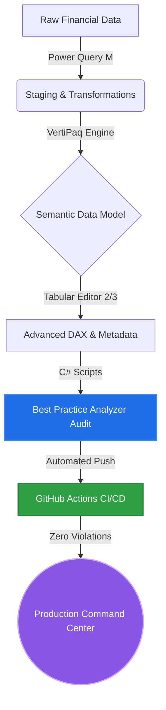

# 📊 Strategic Profitability & Margin Diagnostics Command Center


*(Tip: You can place an animated GIF of your dashboard in action here! Example: ``)*

## 🚀 Enterprise Analytics Pipeline & CI/CD Architecture

This project strictly follows an automated deployment and validation pipeline, ensuring only highly optimized, error-free models reach production.



---

## 📌 Executive Summary & The Business Problem
This project is an enterprise-grade Power BI analytical solution designed to diagnose and combat margin erosion. The core business challenge analyzed here is a phenomenon known as **"buying market share."** 

Despite maintaining a steady Year-to-Date (YTD) Revenue of ~$3.05M (+0.22% YoY), the Gross Margin percentage collapsed from a historical baseline of >30% down to 16.3%. This Command Center was built to deconstruct the "Why" behind the variance and provide actionable insights for the FP&A (Financial Planning & Analysis) and Sales controlling teams.

---

## 🧠 1. FP&A & Controlling Deep Dive: The Business Narrative

The traditional "Year-over-Year Variance" analysis often creates a false sense of security. This analytical model was built to shift the narrative from *reporting what happened* to *diagnosing why it happened*.

### 🔍 Price-Volume-Mix (PVM) Diagnostics
The cornerstone of this model is the dynamic PVM Bridge. Standard financial reporting shows a margin drop of $25.27% YoY. By mathematically isolating the variance drivers, the model reveals:
*   **The Price Leakage:** Volume and Cost impacts were negligible (+$1.45K and +$18.4K). The entire margin erosion is isolated to **Price Impact (-$188.11K)**. The sales force is driving volume through severe, undocumented commercial discounting.
*   **Strategic Imperative:** The business does not have a cost control problem; it has a severe price realization and discount governance problem. 

### 🎯 Customer Quadrant Analysis: The "Empty Calories" Problem
Not all revenue is good revenue. The Customer Profitability Matrix dynamically plots clients on a Revenue YoY vs. Gross Margin % scatter plot. 
*   **Value Destroyers:** Accounts located in the bottom-right quadrant show massive YoY revenue growth (>100%) but operate at single-digit or negative margins. These are "empty calorie" accounts—cannibalizing operational capacity without contributing to the bottom line.

### 💼 Portfolio Optimization & Dynamic Upsell
To recover the diluted margin, the dashboard prescribes cross-sell opportunities. The table dynamically calculates the "Opportunity Gap" by evaluating current penetration of high-yield products and suggesting targeted upsell campaigns to close the revenue gap.

---

## ⚙️ 2. Senior Power BI Architecture: Under the Hood

Translating complex FP&A logic into a lightning-fast Power BI model requires strict adherence to Enterprise BI patterns. This model is engineered for scale, maintainability, and VertiPaq engine optimization.

### 🏗️ Data Modeling & VertiPaq Optimization
*   **Strict Star Schema:** The foundation is a fully normalized Star Schema. Fact tables (`Fact_Sales`) are entirely hidden from the end-user, exposing only explicit DAX measures.
*   **Data Type Engineering:** To maximize memory compression and eliminate floating-point arithmetic errors (crucial in financial models), all monetary and percentage columns are cast to `Fixed Decimal`, and keys are cast to `Integer`.
*   **MDX Attribute Disabling:** To reduce memory footprint and speed up processing, the `IsAvailableInMdx` property is set to `false` for non-attribute fact columns, preventing the engine from building unnecessary hidden hierarchies for Excel PivotTable consumption.

### 💻 Advanced DAX & Disconnected Tables
*   **Dynamic PVM Waterfall:** The calculation relies on a disconnected table (`Steps_PVM`) and complex DAX `SWITCH()` logic. This allows the DAX engine to inject virtual rows into the visual context, calculating iterative variances dynamically.
*   **Parameter-Driven Slicers:** Disconnected tables via `GENERATESERIES` allow users to inject custom variables directly into the DAX filter context for real-time scenario simulations.

---

## 🔬 3. Advanced DAX Showcase: In-Memory SVG Rendering

To maximize visual performance and eliminate the need for heavy custom visuals, KPI trendlines are rendered natively using Vector Graphics (SVG) computed dynamically in memory.

<details>
<summary><b>🔥 Click to expand: Dynamic SVG Sparkline DAX Formulation</b></summary>

```dax
KPI Card SVG (Gross Margin over Date) = 
VAR _LineColor = "#005a9e"
VAR _Data = 
    ADDCOLUMNS(
        SUMMARIZE('Calendar', 'Calendar'[Date]),
        "@Value", [Gross Margin %]
    )
VAR _MinX = MINX(_Data, 'Calendar'[Date])
VAR _MaxX = MAXX(_Data, 'Calendar'[Date])
VAR _MinY = MINX(_Data, [@Value])
VAR _MaxY = MAXX(_Data, [@Value])

// Dynamic Path Generation
VAR _Path = 
    CONCATENATEX(
        _Data,
        VAR _X = DIVIDE('Calendar'[Date] - _MinX, _MaxX - _MinX) * 100
        VAR _Y = 100 - (DIVIDE([@Value] - _MinY, _MaxY - _MinY) * 100)
        RETURN _X & "," & _Y,
        " ",
        'Calendar'[Date], ASC
    )
    
RETURN 
    "data:image/svg+xml;utf8," & 
    "<svg xmlns='[http://www.w3.org/2000/svg](http://www.w3.org/2000/svg)' viewBox='0 0 100 100'>" &
    "<polyline points='" & _Path & "' fill='none' stroke='" & _LineColor & "' stroke-width='3' stroke-linecap='round'/>" &
    "</svg>"
```
</details>

---

## 🏆 4. Quality Assurance & Automation

This `.bim` semantic model has been rigorously audited against the official Microsoft Best Practice Analyzer (BPA) ruleset via Tabular Editor. It boasts **0 errors and 0 warnings**, proving full compliance with formatting, performance, and maintenance standards.

### 🤖 Tabular Editor C# Automation Scripts
To ensure zero BPA errors and maintain strict Enterprise BI hygiene, custom C# scripts utilizing the Tabular Object Model (TOM) were developed. These are available in the `/scripts` directory of this repository:
*   `Auto_Descriptions.csx`: Automatically generates English business definitions for all visible dimensions and attributes.
*   `Model_Hygiene.csx`: Enforces `SummarizeBy = None` on non-facts and dynamically hides technical columns.
